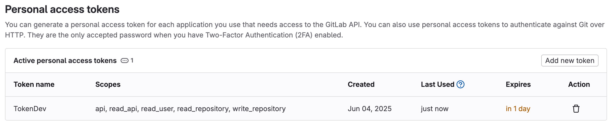

# @congtuandevmobile/react-native-cache-build-gitlab

GitLab Generic Package provider for [RockJS](https://rockjs.dev) with single package support.

## Features

📦 **Single Package Storage**: All native builds (iOS & Android) stored in one package.

🧾 **Fingerprint-based Lookup**: Fast artifact retrieval by filename matching.

🤖️ **CI/CD Ready**: Works seamlessly with GitLab CI.

🪙 **Cost Effective**: Reduces package registry clutter.


## Installation

```bash
npm install react-native-cache-build-gitlab
# or
yarn add react-native-cache-build-gitlab
```

## ⚠️ Important
> You must configure your project according to the [RockJS documentation](https://www.rockjs.dev/docs/cli/migrating-from-community-cli).

## Before to use this provider, make sure you have:

Create a GitLab Personal Access Token (PAT) and expose it locally as the environment variable **CI_JOB_TOKEN**.
### **1. Create a Personal Access Token**
* Go to **GitLab** → **Edit profile** → **Personal access tokens**.
* Click **Add new token**.
* Give the token a name and expiration date (recommended).
* Select scopes you need (commonly: read_api, read_package_registry, write_package_registry).
* Create the token and copy it now — GitLab shows it only once (**Note: You need copy it now because you won't be able to see it again**).



### **2. Expose the token as an environment variable**

**⚠️ Important:** The provider expects the environment variable name to be ***CI_JOB_TOKEN***.

* #### Temporary (current shell session only)
```bash
export CI_JOB_TOKEN=glt-abc123...
````

### Persist permanently (macOS with Zsh)
* Open your Zsh config:
```bash
nano ~/.zshrc
```
* Add the line:
```bash
export CI_JOB_TOKEN=glt-abc123...
```
* Reload your shell:
```bash
source ~/.zshrc
```
* Verify:
```bash
echo $CI_JOB_TOKEN
```

## Usage

In your `rock.config.mjs`:

```ts
import {platformIOS} from "@rock-js/platform-ios";
import {platformAndroid} from "@rock-js/platform-android";
import {providerGitLab} from "react-native-cache-build-gitlab";
import {pluginMetro} from "@rock-js/plugin-metro";

export default {
    bundler: pluginMetro(),
    platforms: {
        ios: platformIOS(),
        android: platformAndroid(),
    },
    remoteCacheProvider: providerGitLab({
        packageName: "mobile-artifacts", 
        registryServer: "https://your-gitlab-instance.com",
        projectId: 1234,
        /*
        * token: default is process.env.CI_JOB_TOKEN
        * tokenHeader: default is process.env.CI ? "JOB-TOKEN" : "PRIVATE-TOKEN"
        * */
    }),
    fingerprint: {
        ignorePaths: [
            "ios/Podfile.lock",
            "ios/**/xcuserdata",
            "ios/**/project.pbxproj",
            // Add more paths to ignore as needed
        ],
    },
};
```

## Configuration

| Option        | Type                             | Description                                                                                     |
| ------------- | -------------------------------- |-------------------------------------------------------------------------------------------------|
| `packageName` | `string`                         | Package name in GitLab Generic Package Registry                                                 |
| `registryServer`     | `string`                         | GitLab instance URL                                                                             |
| `projectId`   | `number`                         | GitLab project ID                                                                               |

## How It Works

### Upload (CI)

All builds are uploaded to a **single package** with version `1.0.0` (Can change version if needed) at *Package Registry*.:

>You can use the script **upload-cache-remote.sh** from **example** to upload build cache to GitLab Package Registry.

```
mobile-artifacts@1.0.0/
  ├── rock-ios-simulator-Debug-{fingerprint}.zip
  ├── rock-android-devDebug-{fingerprint}.zip
  └── ...
```

### Download (Local/CI)

When running:

1. Calculate project fingerprint
2. Search for file containing the fingerprint
3. Download and extract

## GitLab CI Example

```yaml
build_android_cache:
  stage: build
  script:
    - bun run build:android --variant=devDebug
    - CACHE_DIR="$(ls -1dt .rock/cache/remote-build/rock-android-* | head -n1)"
    - sh scripts/upload-cache-remote.sh "${CACHE_DIR}" rock-android-devDebug-{FP}.zip android
```

## License

MIT

## Author

Nguyễn Công Tuấn <nguyencongtuan.devmobile@gmail.com>
