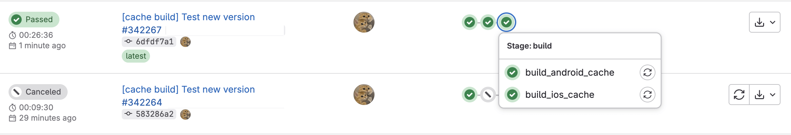
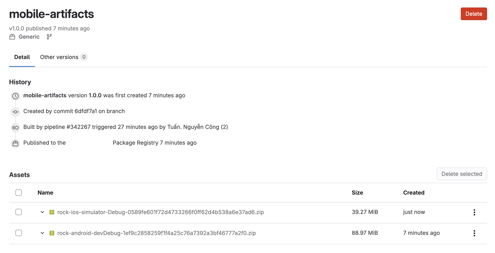
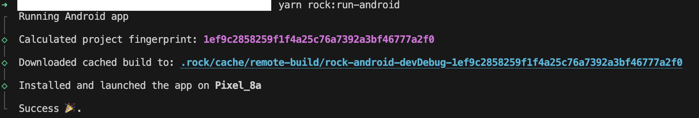
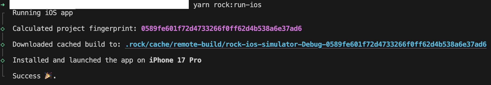

# @congtuandevmobile/react-native-cache-build-gitlab

GitLab Generic Package provider for [RockJS](https://rockjs.dev) with single package support.

## Features

📦 **Single Package Storage**: Stores all native builds (iOS & Android) in a single GitLab Generic Package.

🧾 **Fingerprint-based Lookup**: Fast artifact retrieval by filename matching.

🤖️ **CI/CD Ready**: Works seamlessly with GitLab CI.

🪙 **Cost Effective**: Reduces package registry clutter by grouping artifacts.


## Installation

```bash
npm install react-native-cache-build-gitlab
# or
yarn add react-native-cache-build-gitlab
```

## ⚠️ Prerequisites & Configuration
**Important:** You must configure your project according to the [RockJS documentation](https://www.rockjs.dev/docs/cli/migrating-from-community-cli).

Before using this provider, you need to set up authentication. This provider uses `CI_JOB_TOKEN` as the default environment variable for authentication.

### **1. Create a Personal Access Token**
* Go to **GitLab** → **Edit profile** → **Personal access tokens**.
* Click **Add new token**.
* Give the token a name and expiration date (recommended).
* Select scopes you need (commonly: `read_api`, `read_repository`, `write_repository`).
* Create the token and copy it now — GitLab shows it only once.


### **2. Expose the token as an environment variable**

The provider expects the token in the `CI_JOB_TOKEN` environment variable

#### Temporary (Current Shell)
```bash
export CI_JOB_TOKEN=glt-abc123...
````

#### Permanent (macOS/Linux - Zsh):
```bash
echo 'export CI_JOB_TOKEN=glpat-abc123...' >> ~/.zshrc
source ~/.zshrc
```
**Note:** In GitLab CI pipelines, `CI_JOB_TOKEN` is automatically injected, so you don't need to configure it manually there.

## Usage

In your `rock.config.mjs`:

```ts
import {platformIOS} from "@rock-js/platform-ios";
import {platformAndroid} from "@rock-js/platform-android";
import {providerGitLab} from "react-native-cache-build-gitlab";
import {pluginMetro} from "@rock-js/plugin-metro";

export default {
    bundler: pluginMetro(),
    platforms: {
        ios: platformIOS(),
        android: platformAndroid(),
    },
    remoteCacheProvider: providerGitLab({
        packageName: "mobile-artifacts", 
        registryServer: "https://your-gitlab-instance.com",
        projectId: 1234,
        /*
        * token: process.env.CI_JOB_TOKEN (default)
        * tokenHeader: default is process.env.CI ? "JOB-TOKEN" : "PRIVATE-TOKEN" (default)
        * */
    }),
    fingerprint: {
        ignorePaths: [
            "ios/Podfile.lock",
            "ios/**/xcuserdata",
            "ios/**/project.pbxproj",
            // Add more paths to ignore as needed
        ],
    },
};
```

## Configuration

| Option           | Type     | Description                                                          |
|------------------|----------|----------------------------------------------------------------------|
| `packageName`    | `string` | Package name in GitLab Generic Package Registry                      |
| `registryServer` | `string` | GitLab instance URL                                                  |
| `projectId`      | `number` | GitLab project ID                                                    |
| `token`          | `string` | (Optional) Auth token. Defaults to `process.env.CI_JOB_TOKEN`        |
| `tokenHeader`    | `string` | (Optional) Auth token header. Defaults to `process.env.CI ? "JOB-TOKEN" : "PRIVATE-TOKEN"`|


## How It Works

### Upload (CI)
When your CI pipeline runs, you can use a script to upload the build artifacts to the GitLab Package Registry. (See the `example` folder in the repository for the `upload-cache-remote.sh` script).



### Registry Structure 

All builds are uploaded to a single package version (e.g., 1.0.0).



```
mobile-artifacts@1.0.0/
  ├── rock-ios-simulator-Debug-{fingerprint}.zip
  ├── rock-android-devDebug-{fingerprint}.zip
  └── ...
```

### Download (Local)

When you run `yarn rock:run-ios` or `yarn rock:run-android`:

1. Rock calculates the **project fingerprint**.
2. The provider searches the GitLab Package for a file containing that fingerprint.
3. If found, it downloads and extracts the artifact automatically.

> Android:


> iOS:


## GitLab CI Example

```yaml
build_android_cache:
  stage: build
  script:
    - bun run build:android --variant=devDebug
    - CACHE_DIR="$(ls -1dt .rock/cache/remote-build/rock-android-* | head -n1)"
    - sh scripts/upload-cache-remote.sh "${CACHE_DIR}" rock-android-devDebug-{FP}.zip android
```
> ***You can refer to the CI gitlab config in folder example***

## License

MIT

## Author

Nguyễn Công Tuấn <nguyencongtuan.devmobile@gmail.com>
